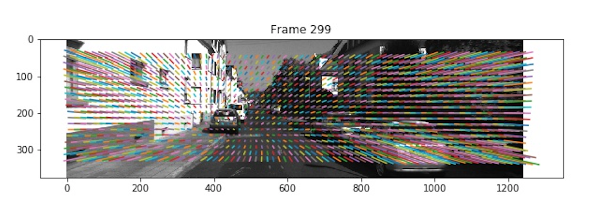
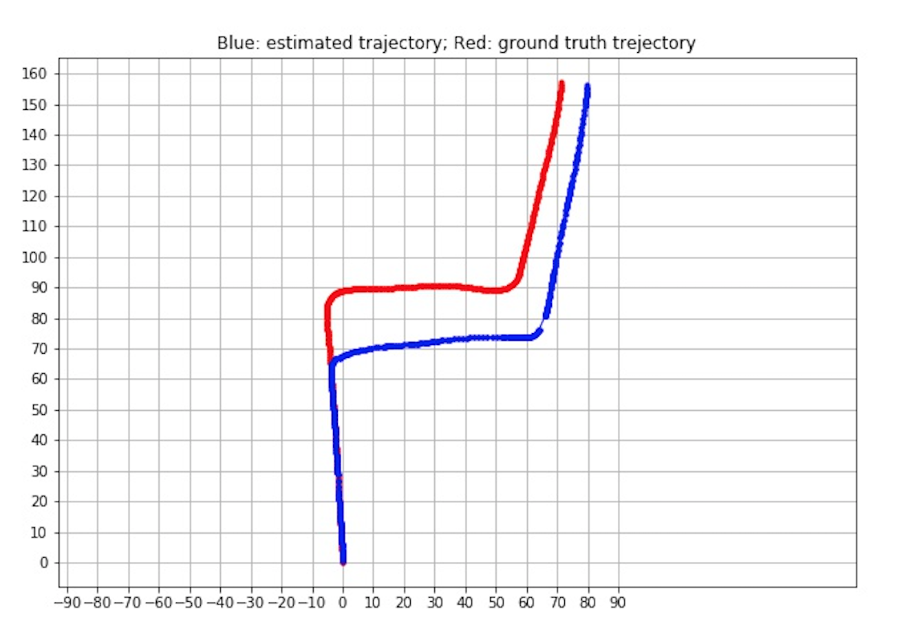

# Monocular Camera Visual Odometry
This repository contains code for monocular camera visual odometry using [libviso2](http://www.cvlibs.net/software/libviso/). Features extracted using [SIFT](https://docs.opencv.org/master/da/df5/tutorial_py_sift_intro.html), evaluated on the [KITTI dataset](http://www.cvlibs.net/datasets/kitti/raw_data.php).


## Requirements
To install requirements:
```setup
pip install -r requirements.txt
```
Please also install libviso python wrapper. Follow instruction [here](https://github.com/jlowenz/pyviso2#getting-started).


## Dataset
The algorithm is evaluated on the KITTI dataset. You can download sample data to test this repo. 
- [Data download](https://drive.google.com/file/d/1ec5Fe3p2Sf0j_wV6mE7JVVXXwwZejVZV/view?usp=sharing)

> For the complete dataset, please visit KITTI dataset [website](http://www.cvlibs.net/datasets/kitti/raw_data.php).

## SIFT Features
To compute SIFT features for each frame, run this command:

```train
python runSIFT.py --input /path/to/dataset_SfM
```
Features extracted by SIFT 


## Visual Odometry
To run visual odometry using [libviso2](http://www.cvlibs.net/software/libviso/), run this command:
```
python runFeature.py
```

The final vehicle trajectory look like this


## Results
Our algorithm achieves the following performance on [KITTI dataset](http://www.cvlibs.net/datasets/kitti/raw_data.php) (tested on sequence 00):
Mean Rotation Error| Mean Translation Error
:--:|:--:
0.00277 |0.53721

## Reference
1. pyviso2, libviso2 python wrapper: https://github.com/jlowenz/pyviso2
2. http://www.cvlibs.net/software/libviso/
3. OpenCV SIFT: https://docs.opencv.org/master/da/df5/tutorial_py_sift_intro.html